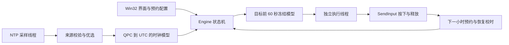

# 程序结构

| 文件 | 职责 |
|---|---|
| `src/app_info.hpp` | 中文名、英文名和生成的版本信息 |
| `src/core.*` | 严格时间解析、来源配置、多源一致性与优选、频率拟合 |
| `src/platform.*` | QPC、UTC、Win32 系统校时、配置读写、窗口位置、输入计划与精确等待 |
| `src/ntp.*` | 可取消 DNS、UDP、NTP 四时间戳与协议验证 |
| `src/engine.*` | 同步/冻结/执行状态机、后台线程、误差预算、日志 |
| `src/main.cpp` | Win32 GUI、数值输入、预约持久化、权限提示与窗口生命周期 |
| `tests/tests.cpp` | 算法、协议、状态和 Windows 资源测试 |

## 时间与输入的边界

系统时间用于启动纪元与对比，任务调度使用独立 QPC 映射。每次 NTP 收发使用同一基准，避免系统时间改写影响四时间戳计算。成功对时只在新有效主用样本通过筛选后记录；失败时保留旧模型和原成功时间。

到达目标前 60 秒时停止查询和模型应用，晚到响应不能穿过冻结屏障。专用执行线程使用高分辨率相对等待定时器，再以短段 QPC 自旋逼近截止时刻。关键提交路径不执行 DNS、文件写入、GUI 锁等待或脚本解释。

一次操作以 down 为定时起点，随后保持并提交 up。取消会停止后续事件并尽力释放本程序已按下的输入。成功后恢复同步并安排下一小时；不补发错过的历史操作。

NTP 估计精度、SendInput 提交精度和目标程序响应精度分别记录。普通 Windows 与公网 NTP 不提供严格的 UTC ±1 ms 保证。
